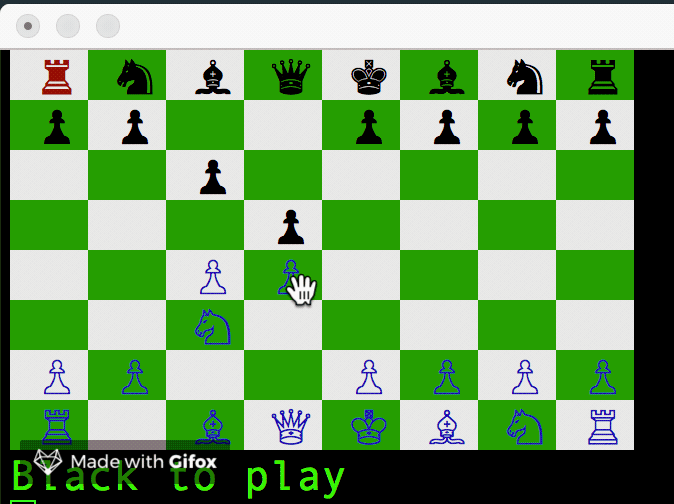

# Chessinal

This is a chess app you can play in your terminal!

How to Play
  * Download the code from this repository
  * Navigate to the chess folder and run ruby game.rb
  * You will be prompted whether you want to play single or multiplayer
  * Enter an option (1 for singleplayer, 0 for multiplayer)
  * Move with either the arrow keys and WASD keys and select squares with the space bar
  * Enjoy the game!

The AI in this program is implemented by using the Negamax algorithm with alpha-beta pruning. Since chess is a zero-sum gain we can take advantage of the fact that max(a, b) = -min(-a, -b) and abstract away the need for two cases. Here is a snippet from the algorithm.

```ruby
def negamax(board, depth, a, b, color)
  if depth == 0
    return color * board.evaluate()
  end
  get_color = color == 1 ? :W : :BLK
  moves = get_computer_moves(board, get_color)
  best_val = -100000
  best_move = nil
  moves.each do |move|
    new_board = board.dup
    new_board.move_piece(move[0], move[1])
    value = -negamax(new_board, depth - 1, -b, -a, -color)
    a = [a, value].max
    return a if a >= b
    if value > best_val
      best_move = move
      best_val = value
    end
  end
  return best_val
end
```

I also took advantage ruby's polymorphic associations by creating
two modules that each piece inherited from

```ruby
module SlidingPiece

  include SteppingPiece

  def moves(move_dirs_arr)
    output = []
    starting_pos = pos
    move_dirs_arr.each do |dir|
      while true
        newpos= get_new_pos(starting_pos, dir)
        if board.validate!(starting_pos,newpos)
          output.push(newpos)
          starting_pos = newpos
        else
          if is_enemy?(newpos)
            output.push(newpos)
          end
          starting_pos=pos
          break
        end
      end
    end
    return output
  end
end
```

```ruby
module SteppingPiece

  def moves(move_dirs_arr)
    output = []
    starting_pos = pos
    move_dirs_arr.each do |dir|
      newpos= get_new_pos(starting_pos, dir)
      if board.validate!(starting_pos,newpos)
        output.push(newpos)
      else
        if is_enemy?(newpos)
          output.push(newpos)
        end
      end
    end
    output
  end

  def get_new_pos(pos, dir)
    pos.map.with_index do |el, i|
      el + dir[i]
    end
  end

  def is_enemy?(pos)
    board.valid_pos?(pos) && board[pos].color != self.color
  end
end
```


